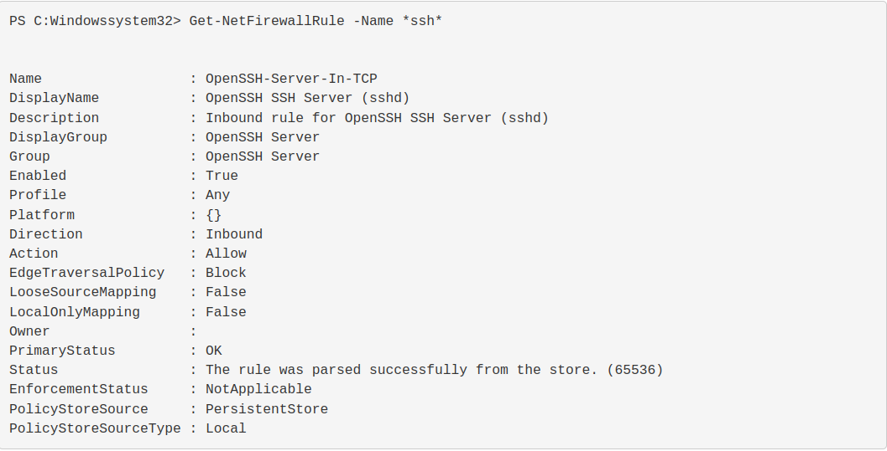

# How to setup and check ssh status on Win 10

* these are my short notes on how to set up ssh on Win10 but if you need a more in detail description check out this repo's scource blog **[here](https://www.pugetsystems.com/labs/hpc/How-To-Use-SSH-Client-and-Server-on-Windows-10-1470/)**

**[Back to the Command-Center](https://github.com/codetorok/command-center/blob/master/README.md)**

## To check the name and state of the ssh service:

`Get-WindowsCapability -Online | ? Name -like 'OpenSSH*'`

The output should look something like this:

That is telling you that the ssh client is installed. (It's ready to use by default in recent Windows 10 builds.) The server is not setup yet.

Add the OpenSSh server component:

`Add-WindowsCapability -Online -Name OpenSSH.Server~~~~0.0.1.0`

You now have the ssh server installed but it is not running. The next command will start the service:

`Start-Service sshd`

In order to avoid having to manually start sshd you can do the following to have it start on boot.

`Set-Service -Name sshd -StartupType 'Automatic'`

The last thing to check is the firewall setting for sshd. It by default uses the port number 22. Enabling the service automatically created the following firewall rules:

`Get-NetFirewallRule -Name *ssh*`

